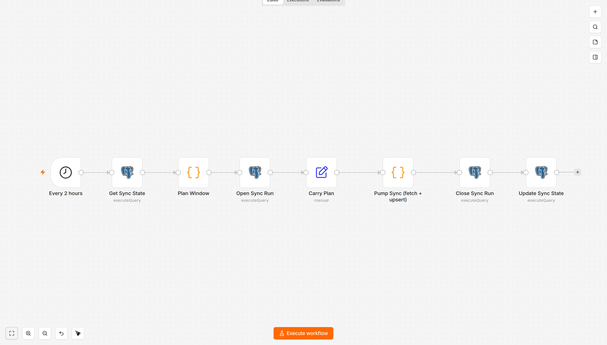

# NVD → Postgres sync (n8n)

Mirrors the NIST NVD CVE database into a hardened, dedicated Postgres instance
on a 2-hour schedule via an n8n workflow. Delta sync is driven by a `last_modified`
high-water mark — the initial backfill is one-time (~352k CVEs, ~40 min on a
home pipe), every run after that fetches only what changed since the last one.



The pump (one Code node) streams pages from NVD one at a time and batches
each page into a single multi-row `INSERT … ON CONFLICT` against Postgres,
so memory stays bounded irrespective of dataset size. See
[Design notes](#design-notes) for why this replaces the more obvious
HTTP-pagination-into-Postgres-node chain.

## Consumers

- **[DockerGuard](https://github.com/vagedis74/dockerguard)** — Docker security
  scanner. Run with `--nvd-mirror-url postgres://nvd_app:…@host:5432/nvd`
  (or set `NVD_MIRROR_URL` in the environment) to source CVEs from this mirror
  instead of NVD's public API; combine with `--cpe-match` to surface CVEs that
  OSV doesn't index for OS packages.

## Layout

```
.
├── .env                              # secrets (chmod 600, gitignored)
├── .env.example                      # template with placeholders
├── docker-compose.yml                # postgres + n8n
├── postgres/init/
│   ├── 00-create-app-role.sh         # creates least-priv role nvd_app
│   └── 01-schema.sql                 # cves, sync_state, sync_runs + indexes
└── n8n/workflows/
    └── nvd-sync.json                 # the workflow to import
```

## Security posture

| Concern              | Mitigation                                                                       |
| -------------------- | -------------------------------------------------------------------------------- |
| Network exposure     | Postgres + n8n bound to `127.0.0.1` only (`ports: "127.0.0.1:5432:5432"` etc).   |
| Password storage     | `scram-sha-256` enforced both at-rest (`password_encryption`) and on the wire.   |
| Privilege separation | `nvd_owner` runs DDL; `nvd_app` (used by n8n) has only `SELECT/INSERT/UPDATE`.   |
| Secrets at rest      | `.env` is `chmod 600` and gitignored. n8n credentials encrypted with `N8N_ENCRYPTION_KEY`. |
| UI authentication    | n8n owner account (set on first visit); password lives only in n8n's encrypted store. |
| Container escape     | `no-new-privileges: true` on both services; CPU + RAM limits set.                |
| API abuse            | Workflow rate-limited to 1 req / 700ms (under NVD's 50 / 30s with a key).        |
| SQL injection        | All values passed as parameterized `$N` placeholders to the pg driver.           |
| Audit trail          | Every sync logged to `sync_runs` (status, window, counts, error).                |

## Performance optimizations

| Lever                  | Setting                                                                          |
| ---------------------- | -------------------------------------------------------------------------------- |
| Streaming pump         | One Code node fetches + upserts one page at a time. Memory bounded irrespective of dataset size — see [Design notes](#design-notes). |
| Delta sync             | `lastModStartDate` = high-water mark; only changed CVEs are fetched after run 1. |
| Page size              | `resultsPerPage=2000` (NVD max).                                                 |
| Batched writes         | One parameterized multi-row `INSERT … ON CONFLICT` per page (~2000 rows/query).  |
| No-op suppression      | `WHERE cves.last_modified < EXCLUDED.last_modified` skips redundant rewrites.    |
| Hot-field projection   | CVSS, severity, CWEs, etc. extracted to columns so queries don't probe JSONB.    |
| Index choice           | B-tree on hot filters; GIN on `cwe_ids` + `raw` JSONB; trigram on description.   |
| Postgres tuning        | `shared_buffers=512MB`, `work_mem=16MB`, `wal_compression=on`.                   |
| Stale-run sweep        | Each new sync clears any `running` row older than 2h before opening a new one.   |

## First-time setup

```bash
# 1. Configure secrets
cp .env.example .env
$EDITOR .env                          # fill in NVD_API_KEY and generate strong passwords
chmod 600 .env

# 2. Bring the stack up. Postgres init runs on first volume creation.
docker compose up -d

# 3. Watch the logs until both services are healthy.
docker compose logs -f postgres n8n   # Ctrl-C once you see "Editor is now accessible via:"
```

### Configure n8n (one-time UI flow)

n8n 2.x uses user accounts, not basic auth env vars. On first launch:

1. Open <http://127.0.0.1:5678>. n8n redirects to **Set up owner account** — create one.
   Store these credentials in your password manager; they're not in `.env`.
2. **Credentials → New → Postgres**, name it **exactly** `NVD Postgres (app)`.
   The workflow references the credential by that name.
   - Host: `postgres` (the docker service name on the internal network)
   - Database: `nvd`
   - User: `nvd_app` (or whatever `POSTGRES_APP_USER` is in `.env`)
   - Password: value of `POSTGRES_APP_PASSWORD` from `.env`
   - Port: `5432`
   - SSL: disable (intra-compose network)
   - Click **Test** — should connect.
3. **Workflows → Import from File** → pick `n8n/workflows/nvd-sync.json`.
4. Open the workflow. Each Postgres node should already show the credential bound
   by name; if any shows a yellow warning, pick `NVD Postgres (app)` from the dropdown.
5. Click **Execute Workflow** for the first run.
   - **First run (no high-water mark)**: full historical scan, ~352k CVEs across ~177 pages.
     Expect **~40 min** on a typical home connection.
   - **Subsequent runs**: delta only, typically a few hundred CVEs in <30 s.
6. Once you see `sync_runs.status='success'`, toggle the workflow **Active**.
   The schedule fires every 2 h.

## Monitoring

```sql
-- recent runs
SELECT id, started_at, finished_at,
       window_start, window_end,
       pages_fetched, cves_upserted, total_results, status, error_message
FROM   sync_runs
ORDER  BY started_at DESC
LIMIT  20;

-- current state of the world
SELECT * FROM sync_state;

-- size + count
SELECT COUNT(*) AS cves,
       pg_size_pretty(pg_total_relation_size('cves')) AS size
FROM   cves;

-- recent criticals
SELECT cve_id, cvss_v31_score, cvss_v31_severity, published, description_en
FROM   cves
WHERE  cvss_v31_score >= 9.0
ORDER  BY published DESC
LIMIT  20;
```

Connect from the host:

```bash
PGPASSWORD=$(grep ^POSTGRES_APP_PASSWORD= .env | cut -d= -f2) \
  psql -h 127.0.0.1 -U nvd_app -d nvd
```

## Operational notes

- **Re-initializing the DB**: `docker compose down -v` wipes the volumes. The
  next `up -d` re-runs the init scripts and re-creates the app role from
  whatever password is currently in `.env`.
- **Rotating the app password**: update `POSTGRES_APP_PASSWORD` in `.env`, then
  `docker compose exec postgres psql -U nvd_owner -d nvd -c "ALTER ROLE nvd_app WITH PASSWORD '<new>';"`,
  then update the credential in n8n.
- **Re-running a historical backfill**: `UPDATE sync_state SET last_mod_end_date = NULL WHERE sync_type = 'nvd_cves';`
  and trigger the workflow. It will re-fetch everything; the upsert is
  idempotent and skips rows whose `last_modified` didn't advance.
- **NVD rate limits**: 50 req / 30 s with an API key, 5 req / 30 s without. The
  workflow uses 700 ms between requests = 42.8 req / 30 s, leaving headroom.

## Design notes

Four non-obvious things shaped the current architecture. Worth knowing if you
modify the workflow or hit similar issues in another n8n project:

**1. n8n's HTTP-pagination buffers every page in memory before passing downstream.**
A first attempt used the native HTTP Request node with pagination → Code (transform)
→ Postgres (upsert). At ~5 MB per page × 177 pages, n8n's per-item object overhead
ballooned to roughly 50× the raw payload size — we'd have hit the 2 GB container
limit long before the fetch completed. The current workflow replaces that chain
with a single **"Pump Sync" Code node** that calls `helpers.httpRequest` for one
page at a time and upserts via a direct `pg` client. Memory stays under ~800 MB
for any dataset size.

**2. Code-node sandbox doesn't expose `URLSearchParams`.**
The pump builds query strings by hand (`'k=' + encodeURIComponent(v)`).
Same applies if you need `fetch`, `crypto.webcrypto`, etc. — assume the sandbox
has standard Node ≥18 features but verify before relying.

**3. n8n 2.x task runners have a 300 s default task timeout.**
Long-running Code nodes (like our ~40 min initial backfill) need
`N8N_RUNNERS_TASK_TIMEOUT` bumped — set to `7200` in `docker-compose.yml`.
Without this the JS runner kills the task at 5 min and the workflow logs
"Task execution timed out after 300 seconds".

**4. After a Postgres node, `$json` is replaced with the query result.**
The Postgres node's output is the rows it returned (or `{success: true}` for
non-RETURNING updates), so the downstream node can no longer see fields that
were on the input. To carry values across a Postgres node, reference the
producing node explicitly: `={{ $('Pump Sync (fetch + upsert)').first().json.newHighWater }}`.
The high-water-mark update in this workflow uses that pattern — earlier we lost
the timestamp because Update Sync State was reading `$json.newHighWater` from
the preceding Close Sync Run node, which returns only `{success: true}`.
